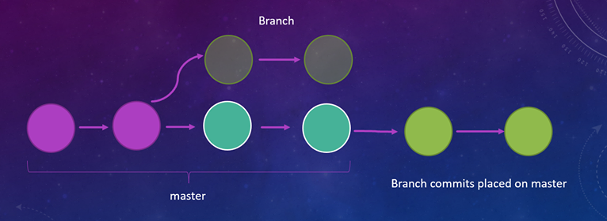
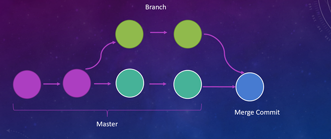

# UofC Solar Car Branching Conventions

## Branch Types & Naming
### Master
The master branch contains the most up-to-date, working code of the program.
The code on master should have passed code review, and all basic checks.

As a result, *no one should ever force push to the master branch!*

### User Branches

User branches are the most common kind of branch, that an individual user opens to work on a task. 
These branches should be short lived as they should only be for small items.

The naming for user branches will be along the lines of `user/<username>/<JIRA-Issue Number>-Quick-Summary`.

For example, `user/bill-luu/SFT-98-Improve-Git-Process`

These branches should (normally) be merged using the *rebase and merge* option, to keep the commit history linear.

### Feature Branches

Feature branches are features that are estimated to take a longer time to complete, and need multiple issues to bring to a stable state before merging into master. It is expected that multiple developers can work on this branch, and make pull requests onto it from their feature branches.

The naming for the feature branches will be along the lines of `feature/<feature-name>`.

For example, `feature/race-optimization-page`

These branches should (normally) be merged using the *Create a Merge Commit* option, as it is usually beneficial to keep the history together.

