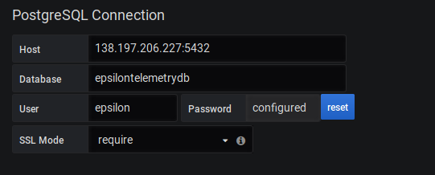
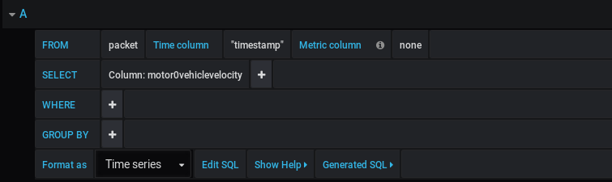
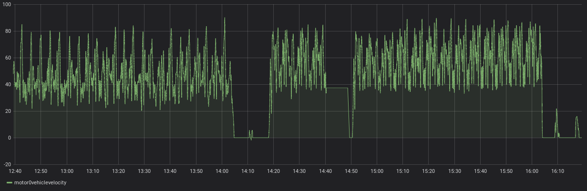

# Grafana Investigation

### Setup

* Used grafana 6.4.2 on linux

`wget https://dl.grafana.com/oss/release/grafana_6.4.4_amd64.deb`

`sudo dpkg -i grafana_6.4.4_amd64.deb`

* `sudo service grafana-server start`
* Go to localhost:3000
* Setup local account
* Add a data source
    * PostgreSQL

* Add a dashboard (I used this configuration)

### Initial findings
* Can pull data from the database
* Performance was too bad to see if it is able to do it in real time
* Can further invesitgate if performance is increased using a db with fewer entries or queries that constrain the time period
* Example graph
* We currently use a relational PostgreSQL database. Different database types such as a time series database may offer better performance for this type of application

